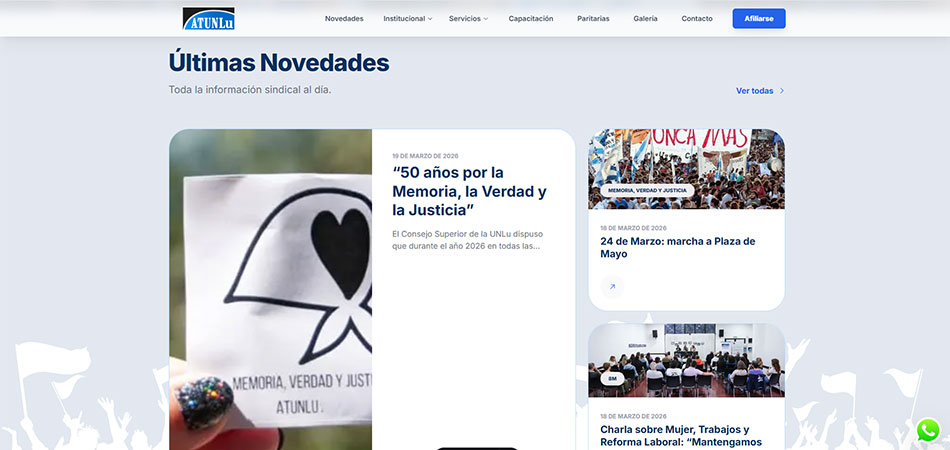
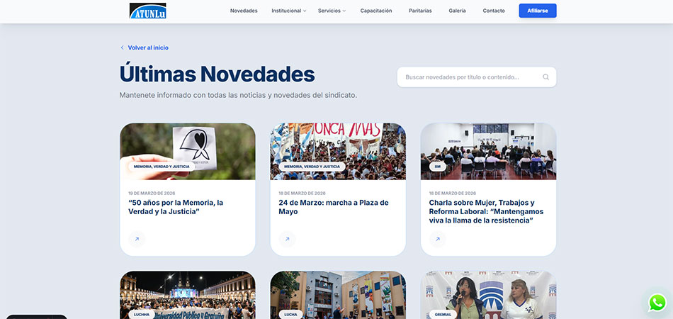
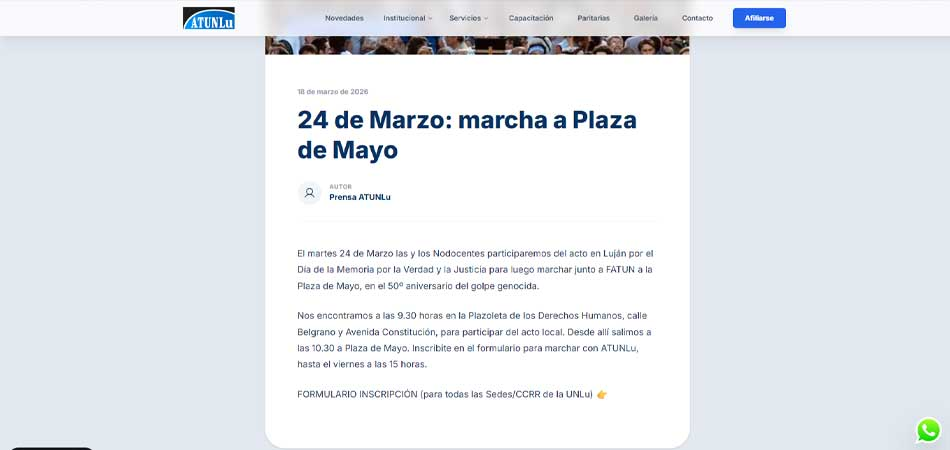

# ATUNLu — Sitio Web Oficial

> [!TIP]
> **Explora el sitio:** Preview en [atunlu-nodocente.vercel.app](https://atunlu-nodocente.vercel.app) (El sitio se encuentra actualmente en desarrollo).

Sitio web oficial de **ATUNLu** (Asociación de Trabajadores de la Universidad Nacional de Luján), sindicato que representa a los trabajadores nodocentes de la UNLu.

---
## 📸 Capturas de pantalla






---

## 🛠 Tecnologías utilizadas

| Tecnología | Versión | Descripción |
|---|---|---|
| [Astro](https://astro.build) | ^6.0.4 | Framework principal de generación de sitios estáticos |
| [TailwindCSS](https://tailwindcss.com) | ^4.2.1 | Framework de estilos utilitarios |
| [@tailwindcss/typography](https://tailwindcss.com/docs/typography-plugin) | ^0.5.19 | Plugin de tipografía enriquecida para contenido Markdown |
| [@tailwindcss/vite](https://tailwindcss.com/docs/installation/using-vite) | ^4.2.1 | Integración de TailwindCSS 4 con Vite |
| [astro-icon](https://github.com/natemoo-re/astro-icon) | ^1.1.5 | Integración oficial de iconos para Astro (SVG en build-time) |
| [Phosphor Icons](https://phosphoricons.com) | (@iconify-json/ph) | Librería de íconos SVG (empaquetados localmente) |
| [PhotoSwipe](https://photoswipe.com) | ^5.4.4 | JavaScript image gallery and lightbox library |
| [Google Fonts — Inter](https://fonts.google.com/specimen/Inter) | (CDN) | Tipografía principal del sitio |

**Requisitos de entorno:**
- Node.js `>= 22.12.0`

---

## 📁 Estructura del proyecto

```text
/
├── public/
│   ├── favicon.ico
│   └── favicon.svg
├── src/
│   ├── assets/
│   │   ├── images/          # Imágenes del sitio (novedades, institución, etc.)
│   │   │   └── iconos/      # Iconos de redes sociales y logos
│   │   ├── background.svg
│   │   └── whatsapp.svg
│   ├── components/
│   │   ├── HeaderAtunlu.astro       # Encabezado principal con navegación responsiva
│   │   ├── Hero.astro               # Sección hero de la página de inicio
│   │   ├── Institucional.astro      # Sección institucional (Historia, Autoridades)
│   │   ├── Servicios.astro          # Tarjetas de servicios (Deportes, Cultura, etc.)
│   │   ├── Novedades.astro          # Listado de las últimas novedades
│   │   ├── NovedadCard.astro        # Tarjeta individual de novedad
│   │   ├── ComisionDirectiva.astro  # Comisión Directiva vigente
│   │   ├── VideoInstitucional.astro # Embed de video institucional de YouTube
│   │   ├── Contacto.astro           # Sección de contacto
│   │   ├── Footer.astro             # Pie de página con enlaces a redes sociales
│   │   ├── Whatsapp.astro           # Botón flotante de WhatsApp
│   │   ├── SearchNovedades.astro    # Buscador de novedades en tiempo real
│   │   ├── ShareButton.astro        # Botón para compartir en redes sociales
│   │   ├── GaleriaCard.astro        # Tarjeta de álbum/galería fotográfica
│   │   └── Header.astro             # Header alternativo
│   ├── content/
│   │   └── novedades/               # Artículos de novedades en formato Markdown
│   ├── content.config.ts            # Definición de colecciones de contenido (Astro Content)
│   ├── layouts/
│   │   └── Layout.astro             # Layout base con header, footer y reveal-on-scroll
│   ├── pages/
│   │   ├── index.astro              # Página de inicio
│   │   ├── autoridades.astro        # Página de autoridades (Comisión Directiva)
│   │   ├── historia/                # Sección Historia de ATUNLu
│   │   ├── afiliacion/              # Información y formulario de afiliación
│   │   ├── galeria/                 # Listado y detalle de galerías fotográficas
│   │   ├── novedades/               # Detalle de cada novedad
│   │   ├── ultimas-novedades.astro  # Archivo completo de novedades
│   │   └── ultimas-novedades/       # Rutas dinámicas de novedades
│   └── styles/
│       └── global.css               # Estilos globales y animaciones reveal
├── astro.config.mjs
├── tsconfig.json
└── package.json
```

---

## 📄 Páginas del sitio

| Ruta | Descripción |
|---|---|
| `/` | Página de inicio con hero, novedades, info institucional, servicios y contacto |
| `/autoridades` | Comisión Directiva actual de ATUNLu |
| `/historia` | Historia del sindicato |
| `/afiliacion` | Información y pasos para afiliarse a ATUNLu |
| `/ultimas-novedades` | Listado completo de novedades con buscador integrado |
| `/novedades/[slug]` | Detalle de cada novedad (ruta dinámica) |
| `/galeria` | Galerías fotográficas de eventos y actividades |

---

## 📝 Colección de contenido: Novedades

Las novedades se gestionan como archivos **Markdown** en `src/content/novedades/`. Cada archivo requiere el siguiente frontmatter:

```yaml
---
title: "Título de la novedad"
description: "Breve descripción"
date: 2025-03-10
image: ../../assets/images/mi-imagen.jpg
imageAlt: "Descripción de la imagen"
category: "Deportes"
author: "Nombre Apellido"   # opcional
draft: false                # opcional, default: false
featured: false             # opcional, default: false
---
```

---

## ⚙️ Alias de rutas (TypeScript)

El proyecto usa alias definidos en `tsconfig.json` para importaciones limpias:

| Alias | Ruta real |
|---|---|
| `@components/*` | `src/components/*` |
| `@layouts/*` | `src/layouts/*` |
| `@styles/*` | `src/styles/*` |
| `@assets/*` | `src/assets/*` |
| `@data/*` | `src/data/*` |
| `@extras/*` | `src/extras/*` |

---

## 🧞 Comandos

Todos los comandos se ejecutan desde la raíz del proyecto:

| Comando | Acción |
| :--- | :--- |
| `npm install` | Instala las dependencias |
| `npm run dev` | Inicia el servidor de desarrollo en `localhost:4321` |
| `npm run build` | Genera el sitio estático en `./dist/` |
| `npm run preview` | Previsualiza el build localmente antes de desplegar |
| `npm run astro ...` | Ejecuta comandos de la CLI de Astro |

---

## 📸 Sistema de Galería

El sitio cuenta con un sistema de galerías fotográficas dinámico que permite gestionar eventos y visualizarlos de forma fluida.

### 📊 Gestión de Datos
Las galerías se definen en `src/data/galerias.ts`. Cada objeto sigue la interfaz `Galeria`:
- **slug**: Identificador único para la URL.
- **titulo**: Nombre del evento o actividad.
- **fecha**: Fecha del evento (formato `YYYY-MM-DD`).
- **portada**: URL absoluta de la imagen de previsualización.
- **fotos**: Array de objetos con `thumb` (miniatura), `highres` (alta resolución) y `alt` (texto descriptivo).

### 🔗 Rutas Dinámicas
El sistema utiliza el sistema de rutas de Astro para generar las páginas:
- `/galeria`: Lista todas las galerías disponibles usando el componente `GaleriaCard`.
- `/galeria/[slug]`: Genera una página individual para cada galería mediante `getStaticPaths`, inyectando los datos correspondientes.

### 🖼️ Visualización (PhotoSwipe)
Para la visualización de imágenes se utiliza **PhotoSwipe v5**, con las siguientes características:
- **Carga Diferida**: Las imágenes en alta resolución se cargan solo al abrir el lightbox.
- **Detección Automática de Tamaño**: Incluye scripts para detectar las dimensiones reales (`naturalWidth`/`naturalHeight`) de cada imagen al cargar o navegar, evitando deformaciones visuales.
- **Seguridad CSS**: Se aplica `object-fit: contain` de forma global en el lightbox para garantizar que la proporción se mantenga en cualquier dispositivo.

### ☁️ Almacenamiento
Las imágenes están alojadas en un servidor de medios externo (`media.leandrobarriosdesigner.site`), optimizando el peso del repositorio y facilitando la gestión de recursos de alta resolución.

---

## 📬 Contacto y datos del sindicato

- **Organización:** ATUNLu — Asociación de Trabajadores de la Universidad Nacional de Luján
- **Universidad:** Universidad Nacional de Luján (UNLu)

---

## ⚖️ Licencia

Este proyecto utiliza un modelo de licencia dividida:

* **Código Fuente:** El código fuente de este sitio web (archivos `.astro`, `.js`, `.css`, etc.) se distribuye bajo la licencia **[MIT](LICENSE)**. Eres libre de usarlo, modificarlo y adaptarlo para tus otros proyectos.
* **Contenido y Activos:** Los logos, fotografías, gráficos institucionales y el contenido de los artículos/textos (como las novedades) **NO** están cubiertos por la licencia MIT. Todo el contenido institucional pertenece a ATUNLu y todos los derechos están reservados.
