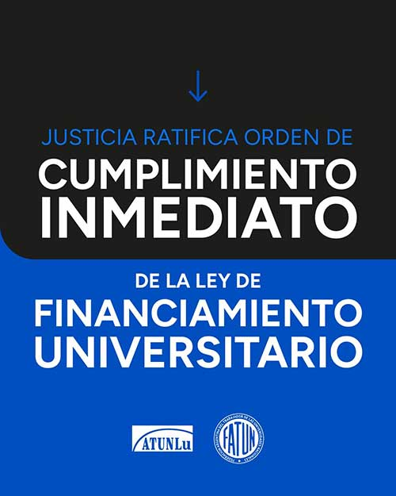

La Cámara Contencioso Administrativo Federal confirmó este martes 31 la resolución de primera instancia que admitió la medida cautelar solicitada por el Consejo Interuniversitario Nacional (CIN) para que se ordene al Poder Ejecutivo Nacional el cumplimiento inmediato de la Ley de Financiamiento Universitario (27.795).

En particular, la cautelar requiere la vigencia urgente de los artículos 5 y 6 de la norma, referidos a la actualización de los salarios de los Docentes y Nodocentes de las universidades públicas y a la
recomposición de todos los programas de becas del estudiantado.

El fallo coincide con una enorme jornada de lucha en todas las universidades nacionales, en las que las y los Nodocentes llevamos adelante un paro de 24 horas, sin asistencia a los lugares de trabajo, reclamando que el gobierno cumpla con la Ley de Financiamiento Universitario.

Por otra parte, el lunes 30 el Juzgado Nacional de Primera Instancia del Trabajo N° 63 ordenó la suspensión provisoria de 83 artículos de la denominada “Ley de Modernización Laboral”, haciendo lugar a un pedido de la Confederación General del Trabajo (CGT).

Estas decisiones judiciales deben entenderse como fruto como de la gran lucha del Movimiento Obrero, en defensa de nuestros derechos. Unidos, Solidarios y Organizados vamos a recuperar nuestros salarios y obtener el Presupuesto necesario para las Universidades.

