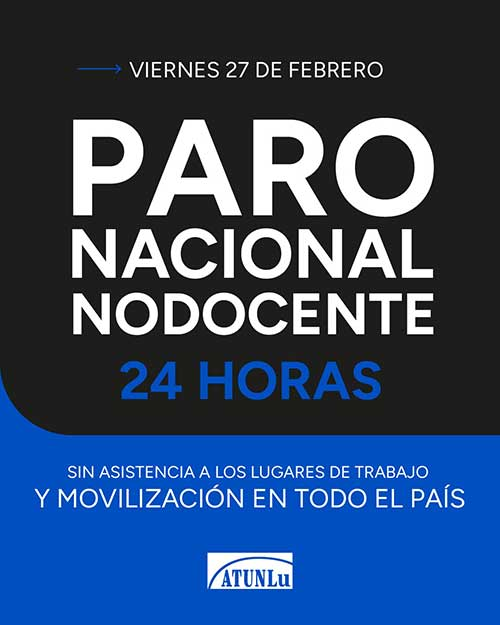

Compañeras y compañeros:
Mañana viernes 27 de febrero, las y los Nodocentes llevamos adelante un Paro Nacional de 24 horas, sin asistencia a los lugares de trabajo y con movilización en todo el país, en defensa de nuestras conquistas, nuestros convenios y nuestra organización sindical.

En Luján, las y los Nodocentes nos encontramos a las 10 h en la sede de ATUNLu para realizar acciones de visibilización, fortaleciendo una jornada colectiva nacional de lucha frente al avance de políticas que atacan los derechos del pueblo trabajador.

La medida fue resuelta por unanimidad en el Consejo Directivo de la FATUN, para manifestar nuestro firme rechazo a esta iniciativa regresiva, impulsada por el Gobierno Nacional y acompañada por sectores legislativos que avanzan contra los derechos individuales y colectivos del pueblo trabajador.

Defendemos nuestras conquistas, nuestros convenios y nuestra organización sindical.

La historia demuestra que los derechos no se entregan: se defienden.

Sigamos luchando en Unidad, Solidaridad y Organización.

